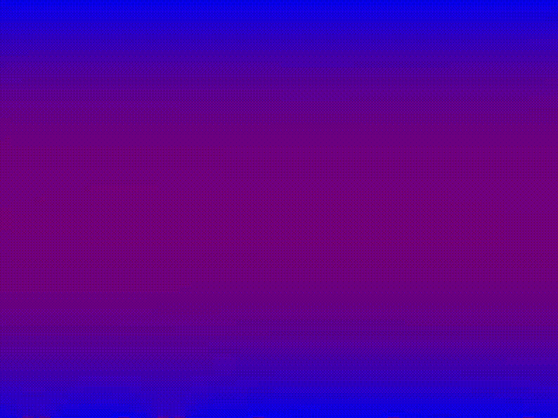
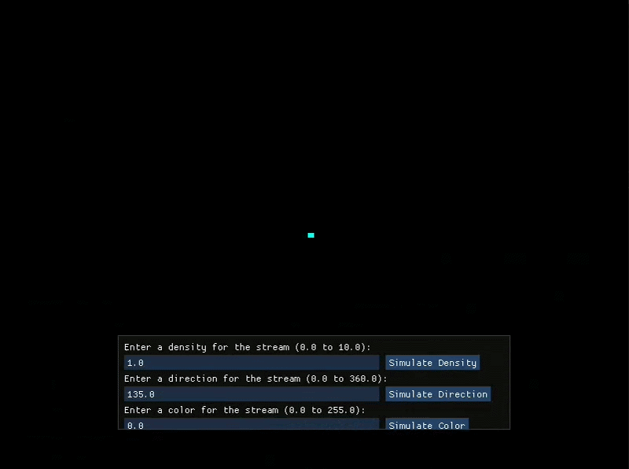

# Fluid-Simulation
Programmation project for the third year of double licence Mathematics/Computer sciences at the University of Montpellier.

### Here a sample of the simulation (Thermal convection, display system tests):
The Simulation can be reset by pressing 'R'.\

Setting pixels to a random temperature.\
The pixels are exchanging heat. (With a calculation of the average heat of neighboring pixels).\
In the end, we get a homogeneous temperature.

### Reel fluid simulation:
Thanks to the document <em>Real-Time Fluid Dynamics for Games</em> by <b>Jos Stam</b>, we implemented reel fluid behavior on the grid testes previously.\

### Interaction while the simulation is running:
We used ImGui to add a window to our simulation (that can be hide by pressing 'H') allowing the user to set some simulation parameters in real-time.\

### Adding other simulations settings and obstacles:
